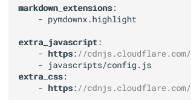

# テストページ

## 項目1

ほげほげ

## 項目２

ふがふが

!!! Note
    Note。

!!! Tip
    Tip。

!!! Success
    Success。

!!! Failure
    Failure。

!!! Warning
    Warning。

!!! Danger
    Danger。

!!! Bug
    Bug。

!!! summary
    summary。

 

ああああ。

これで**画像**がさっとコピペできていいやね

１．マークダウンを<u>そのまま表示させる</u>場合はどうするんだこれ？

２．やっぱり項番は素で書いたほうがMDはいきるなあ。

    ね。

!!! Warning "注意！"
    修飾もできるし。

段落は？

1. いつも

2. こんなかんじで
   
   
   

3. おせわになって

4. います!!! Bug 

5. どうかな？
   

!!! Warning
    Warning。

!!! Warning
     順番つけないようにしようかな。でもいるんだよね。

ああ
